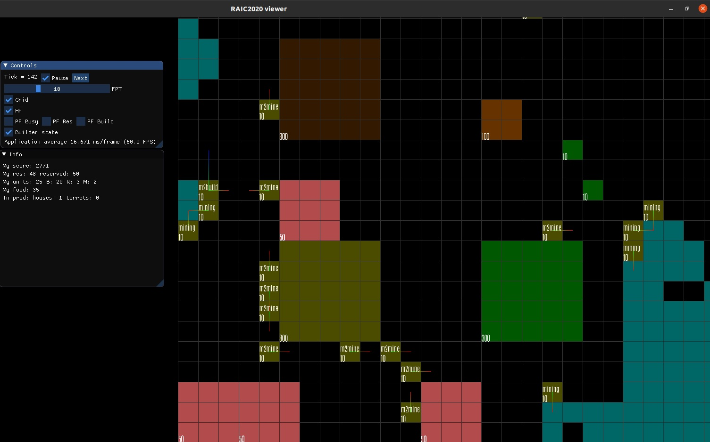

# RAIC2020
Russian AI Cup 2020 — CodeCraft. 235-е место во втором раунде, там и остановился:)
Код стратегии в папке ai, визуализатор в файлах с префиксом vw, сделан при помощи OpenGl 3.3+, glwf, glad, imgui.
Распределение времени получилось ужасным. Визуализатор надо было писать до чемпионата, а не во время, дней пять наверное ушло на него, раньше ничего подобного не делал.
Во второй раунд прошёл через песочницу, затем появились "непредвиденные" сегфолты, выявление причин которых, заняло почти два дня, и поставило крест на попадании в финал.
До управления боевыми юнитами не дошёл, сбор ресурсов и постройка\ремонт строений сделана с помощью потенциальных полей.

